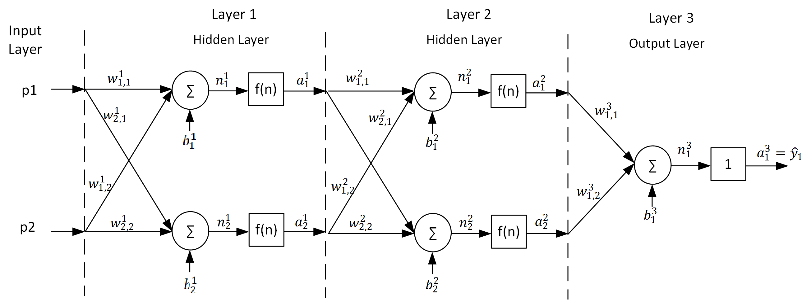
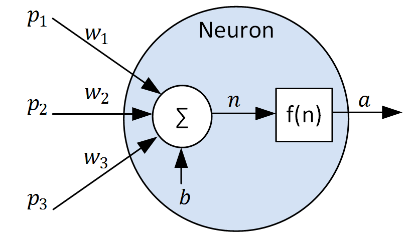
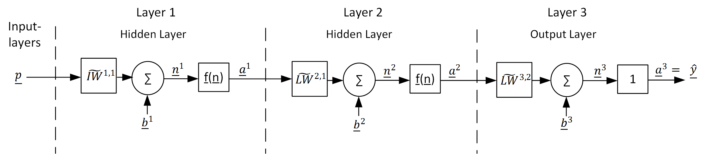

.. currentmodule:: pyrenn

.. _create:

Create a neural network
========================

This chapter describes how to create a feed forward or recurrent neural network in pyrenn.

.. _create-ffnn-ref:

Feed forward neural networks in pyrenn
--------------------------------------

pyrenn allows to create `multilayer perceptron (MLP)`_ neural networks. A MLP is a feedforward artificial neural network, that is defined by:

* an input layer with :math:`R` inputs
* :math:`M-1` hidden layers, where each layer :math:`m` has an abritary number of neurons :math:`S^\text{m}` 
* and an output layer with :math:`S^\text{M}` number of neurons, which corespond to the number of outputs of the neural network

The following notation allows a short description of a MLP which gives the number of inputs :math:`R`, the number of layers :math:`M` and the number of neurons :math:`S^\text{m}` in each layer :math:`m`:

.. math::

	nn = [R\; S^\text{1}\; S^\text{2}\; ...\; S^\text{M}]
	
In a MLP each layer has a full connection to the next layer, which means that each neuron output in layer :math:`m` is an input to each neuron in layer :math:`m+1` (and inputs are connected to all neurons in the first layer).

`figure 1` shows an example of a MLP with 2 inputs, two hidden layers with two neurons each and an output layer with one neuron (and therefore one output :math:`\hat{y}`). The MLP can be described with

.. math::

	nn = [2\; 2\; 2\; 1]
	

   
   Figure 1: A :math:`[2\; 2\; 2\; 1]` MLP

The MLP in `figure 1` consists of 5 neurons. The structure of a neuron is shown in `figure 2`.

   
   Figure 2: Structure of a neuron
   
   
Neurons are the constitutive units in an artificial neural network. They can have several inputs :math:`p` which are multiplied by the connection weights :math:`w` and summed up together with the bias weight :math:`b` to the summation output :math:`n`. Then the neuron output :math:`a` is calculated using the transfer function (also activation function) :math:`f(n)`. 

.. math::
	
	\begin{gather}
	n = \sum_{i} \left( w_{i} \:  p_{i}\right) + b \\
	a = f(n)
	\end{gather}

.. note::

	Generally different transfer function could be used in a neural network. In **pyrenn** the transferfunction is defined as:

	* the hyperbolic tangent :math:`a=tanh(n)` for all neurons in hidden layers
	* the linear function :math:`y=a=n` for all neurons in the output layer

The array-matrix illustration allows a clearer description of a MLP. Therefore the inputs :math:`p`, the neural network outputs :math:`\hat{y}`, the summation outputs :math:`n` , the layer outputs :math:`a`, the transfer functions :math:`f(n)` and the bias weights :math:`b` of one layer :math:`m` are represented by the arrays :math:`\underline{p},\:\underline{\hat{y}},\:\underline{n}^m,\:\underline{a}^m,\:\underline{f}^m,\:\underline{b}^m` (the upper index represents the layer :math:`m`: and the lower index the number of the neuron or input).

 .. math::

	\underline{p} = \begin{bmatrix}
	p_1\\ 
	...\\ 
	p_R\\
	\end{bmatrix}\:
	\underline{\hat{y}}= \begin{bmatrix}
	{\hat{y}}_1\\ 
	...\\ 
	{\hat{y}}_{S^M}\\
	\end{bmatrix}\:
	\underline{n}^m= \begin{bmatrix}
	{n}^m_1\\ 
	...\\ 
	{n}^m_{S^m}\\
	\end{bmatrix}\:
	\underline{a}^m= \begin{bmatrix}
	{a}^m_1\\ 
	...\\ 
	{a}^m_{S^m}\\
	\end{bmatrix}\:
	\underline{f}^m= \begin{bmatrix}
	{f}^m_1\\ 
	...\\ 
	{f}^m_{S^m}\\
	\end{bmatrix}\:
	\underline{b}^m= \begin{bmatrix}
	{b}^m_1\\ 
	...\\ 
	{b}^m_{S^m}\\
	\end{bmatrix}

The connection weights :math:`w` are represented by the matrix :math:`\widetilde{IW}^{1,1}` which contains the connection weights of the first layer and the matrices :math:`\widetilde{LW}^{m,l}`, which contain the weights that connect the outputs of layer :math:`l` with layer :math:`m`. For the example in `figure 1` the connection matrices are:

 .. math::
 
	\widetilde{IW}^{1,1}= \begin{bmatrix}
	w^1_{1,1} & w^1_{1,2} \\ 
	w^1_{2,1} & w^1_{2,2} 
	\end{bmatrix}\;
	\widetilde{LW}^{2,1}= \begin{bmatrix}
	w^2_{1,1} & w^2_{1,2} \\ 
	w^2_{2,1} & w^2_{2,2} 
	\end{bmatrix}\;
	\widetilde{LW}^{3,2}= \begin{bmatrix}
	w^3_{1,1} & w^3_{1,2} \\ 
	w^3_{2,1} & w^3_{2,2} 
	\end{bmatrix}

`figure 3` shows the array-matrix illustration of the MLP of `figure 1` :

	
	Figure 3: Array-matrix illustration of a MLP with two hidden layers
	
.. _multilayer perceptron (MLP): https://en.wikipedia.org/wiki/Multilayer_perceptron

Recurrent neural networks in pyrenn
--------------

pyrenn allows also to define different topologies of `recurrent neural networks`_, which are networks, where connections between units form a directed cycle. In pyrenn this is implemented by connecting the output of a layer :math:`m` with the input of previous layers :math:`<m` or with it's own layer input. Since this would lead to an infeasible system, a real-valued time-delay has to be applied to the recurrent connections. This is done by so called *Tapped Delay Lines* (TDL). A TDL contains delay operators :math:`z^{-d}` which delay time-discrete signals by a real-valued delay :math:`d`. To describe the delay elements in a TDL, the Sets :math:`{DI}^{l,m}` and :math:`{DL}^{l,m}` are introduced. They contain all real-valued delays :math:`d_i` between a connection from the output of layer :math:`l` to the input of layer :math:`m`. Consequently for every :math:`d_i \in {DI}^{l,m}` or  :math:`d_i \in {DL}^{l,m}` there has to be a connection matrix :math:`\widetilde{IW}^{m,l}[d_i]` or :math:`\widetilde{LW}^{m,l}[d_i]`. `figure 4` shows the detailed and simplified illustration a TDL example.  

.. figure:: img/TDL.*
	:width: 95%
	:align: center 
	
	Figure 4: TDL in detailed (a) and simplified (b) illustration

With pyrenn it is possible to define three different types of TDLs, which will add (recurrent) time-delayed connections with their weight matrices to the MLP. The influence of these setting on the neural network structure is explained with the help of `figure 5`.

* Input delays :math:`dIn \in [0,1,2,...]` (blue; default for MLP :math:`dIn=[0]`):

	This allows to delay the inputs :math:`\underline{p}` of the neural network by any real-valued time-step :math:`d \geq 0`. Thereby the neural network can be used for systems where the output depends not only on the current input, but also previous inputs. :math:`dIn` has to be non-empty, otherwise no inputs are connected with the neural network! When the current input should be used in the neural network, :math:`dIn` hast to contain 0. Since this only delays the inputs, this will not lead to a recurrent network.

		.. math::
			
			{DI}^{1,1} = dIn
			
* Output delays :math:`dOut \in [1,2,...]` (green; default for MLP :math:`dOut=[]`):

	This allows to add a recurrent connection of the outputs :math:`\underline{\hat{y}}` of the neural network to it's first layer (which is similar to a recurrent connection of the output of the network to it's input). Thereby the neural network can be used for systems where the output depends not only on the inputs, but also on prevoius outputs (states). Since this adds a recurrent connection if :math:`dIn` is non-empty, the delays has to be greater than zero :math:`d>0`. A neural network with such a connection will be a recurrent neural network.

		.. math::
			
			{DL}^{1,M} = dOut
			
* Internal delays :math:`dIntern \in [1,2,...]` (red; default for MLP :math:`dOut=[]`):
	
	This allows to add a recurrent connection from all layers to all previous layers and to it self (except from the output layer to the first layer). Thereby the neural network can be used for systems where the output depends on prevoius internal states. Since this adds recurrent connections if :math:`dIntern` is non-empty, the delays has to be greater than zero :math:`d>0`. A neural network with such a connection will be a recurrent neural network.	

		.. math::
			
			{DL}^{m,l} = dIntern \;\;\;\;\forall (m \leq l|\; {DL}^{m,l} \neq {DL}^{1,M}) 
		
In pyrenn all forward connections (except the inputs) only have un-delayed direct connections!

.. figure:: img/recurrent_nn.*
	:width: 95%
	:align: center 
	
	Figure 5: Possible delayed and recurrent connections that can be created with pyrenn for a neural network with two hidden layers. 

.. note::

	With the described definitions, every neural network in pyrenn can be defined by only four parameters:
	
	* The short notation :math:`nn` which describes the number of inputs, layers, neurons and outputs
	* the input delays :math:`dIn` of the neural network
	* the output delays :math:`dOut` of the neural network
	* the internal delays :math:`dIntern` of the neural network

	
.. _recurrent neural networks: https://en.wikipedia.org/wiki/Recurrent_neural_network

Creating a neural network with ``CreateNN()``
--------------

The function ``CreateNN`` creates a pyrenn neural network object that can be trained and used. When only the short notation :math:`nn` is given as input, the created neural network will be a MLP with no delayed connections. If a (recurrent) neural network with delays should be created, the parameters :math:`dIn`, :math:`dIntern` and/or :math:`dOut` have to be secified as described above. In the :ref:`examples` different neural network topologies are created.

Python
^^^^^^^^^^^

.. py:function:: pyrenn.CreateNN(nn, [dIn=[0],dIntern=[ ], dOut=[ ]])

	Creates a neural network object with random values between -0.5 and 0.5 for the weights. 

	:param list nn: short notation of the neural network :math:`[R\; S^\text{1}\; S^\text{2}\; ...\; S^\text{M}]`
	:param list dIn: Set of input delays of the neural network
	:param list dIntern: Set of inernal delays of the neural network
	:param list dOut: Set of output delays of the neural network   
	:return: a pyrenn neural network object
	:rtype: dict

Matlab
^^^^^^^^^^^

.. c:function:: CreateNN(nn, [dIn=[0],dIntern=[ ], dOut=[ ]])

	Creates a neural network object with random values between -0.5 and 0.5 for the weights.  

	:param array nn: short notation of the neural network :math:`[R\; S^\text{1}\; S^\text{2}\; ...\; S^\text{M}]`; size [1 x M+1]
	:param array dIn: Set of input delays of the neural network; size [1 x X]
	:param array dIntern: Set of itnernal delays of the neural network; size [1 x X]
	:param array dOut: Set of output delays of the neural network; size [1 x X]
	:return: a pyrenn neural network object
	:rtype: struct

