.. currentmodule:: pyrenn

.. _examples:

Examples
============

The examples given in this chapter show how to create, train and use neural networks in pyrenn for different systems. All examples can be found in the folder ``python\examples`` or ``matlab\examples``.

Friction Curve
------------------------

In this example a neural network is used to learn the friction curve of a system, which is given by the following function, where :math:`F` is the friction force and :math:`v` is the velocity:

.. math::
	
	F = 0.5 * (tanh(25*v) - tanh(v)) + 0.2*tanh(v) + 0.03*v

For training 41 data samples of the velocity and the resulting friction force are given.

This is an example of a **static system with one output and one input** and can be found in ``python\examples\example_friction.py`` and ``matlab\examples\example_friction.m``.

Python
^^^^^^^^^^^

At first the needed packages are imported. pandas for reading the excelfile, matplotlib for plotting the results and pyrenn for the neural network.

::

	import pandas as pd
	import matplotlib.pyplot as plt
	import pyrenn as prn

Then the training input data P and output (target) data Y as well as the test input data Ptest and output data Ytest is read from the given excel file using pandas. Because we have only one input and one output here, the input and output data can be either a 1d numpy array, where the number of elements represents the number of data samples (this is the case here), or a 2d numpy array with shape (1,Q), where Q is the number of data samples.

::

	df = pd.ExcelFile('example_data.xlsx').parse('friction')
	P = df.loc[0:40]['P']
	Y = df.loc[0:40]['Y']
	Ptest = df['Ptest'].values
	Ytest = df['Ytest'].values

Then the neural network is created. Since we have a system with 1 input and 1 output, we need a neural network with the same number of inputs and outputs. For this system we choose a neural network with two hidden layers, each with 3 neurons. Since the friction curve is a static system, we do not need a recurrent network and no delayed inputs, so we do not have to change the delay inputs.

 ::

	net = prn.CreateNN([1,3,3,1])

Now we can train the created neural network ``net`` with the training data P and Y. ``verbose=True`` activates diplaying the error during training. We set the number of iterations (epochs) to 100 and the termination error to 1e-5. The Training will stop after 100 iterations or when Error <= E_stop.

 ::

	net = prn.train_LM(P,Y,net,verbose=True,k_max=100,E_stop=1e-5) 
	
After the training is finished, we can use the neural network. We calculate the neural network output y, using the training data P as input as well as the the output ytest, using the test data Ptest as input.

 ::

	y = prn.NNOut(P,net)
	ytest = prn.NNOut(Ptest,net)

Now we can plot the results, comparing the output of the neural network with the training and the test data of the system.

 ::

	fig = plt.figure(figsize=(11,7))
	ax0 = fig.add_subplot(211)
	ax1 = fig.add_subplot(212)
	fs=18

	#Train Data
	ax0.set_title('Train Data',fontsize=fs)
	ax0.plot(P,y,color='b',lw=2,label='NN Output')
	ax0.plot(P,Y,color='r',marker='None',linestyle=':',lw=3,markersize=8,label='Train Data')
	ax0.tick_params(labelsize=fs-2)
	ax0.legend(fontsize=fs-2,loc='upper left')
	ax0.grid()

	#Test Data
	ax1.set_title('Test Data',fontsize=fs)
	ax1.plot(Ptest,ytest,color='b',lw=2,label='NN Output')
	ax1.plot(Ptest,Ytest,color='r',marker='None',linestyle=':',lw=3,markersize=8,label='Test Data')
	ax1.tick_params(labelsize=fs-2)
	ax1.legend(fontsize=fs-2,loc='upper left')
	ax1.grid()

	fig.tight_layout()
	plt.show()

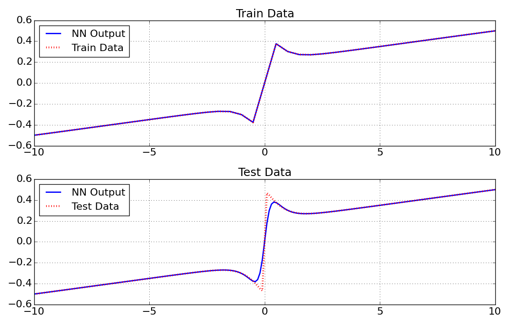
	

Matlab
^^^^^^^^^^^

At first the training input data P and output (target) data Y as well as the test input data Ptest and output data Ytest is read from the given excel file using ``xlsread``. Because we have only one input and one output here, the input and output data has to be an array with size ``(1,Q)``, where Q is the number of data samples. 

.. code-block:: matlab

	file = 'example_data.xlsx';
	num = xlsread(file,'friction');
	P = num(1:41,2).';
	Y = num(1:41,3).';
	Ptest = num(:,4).';
	Ytest = num(:,5).';

Then the neural network is created. Since we have a system with 1 input and 1 output, we need a neural network with the same number of inputs and outputs. For this system we choose a neural network with two hidden layers, each with 3 neurons. Since the friction curve is a static system, we do not need a recurrent network and no delayed inputs, so we do not have to change the delay inputs.

.. code-block:: matlab

	net = CreateNN([1,3,3,1])

Now we can train the created neural network ``net`` with the training data P and Y. In matlab we have the option to train the network with the LM algorithm or the BFGS algorithm.

We start with the LM algorithm. We set the number of iterations (epochs) to 100 and the termination error to 1e-5. The Training will stop after 100 iterations or when Error <= E_stop.

.. code-block:: matlab

	netLM = train_LM(P,Y,net,100,1e-5); 
	
After the training is finished, we can use the neural network. We calculate the neural network output y_LM, using the training data P as input as well as the the output ytest_LM, using the test data Ptest as input.

.. code-block:: matlab

	y_LM = NNOut(P,netLM); 
	ytest_LM = NNOut(Ptest,netLM); 

Now we can do the same using the BFGS algorithm. The BFGS algorithm usually takes less time for one iteration, but needs more iterations to reach the same error than the LM. Therefore we set the number of iterations (epochs) to 200 and the termination error to 1e-5. 

.. code-block:: matlab

	netBFGS = train_BFGS(P,Y,net,200,1e-5);
	y_BFGS = NNOut(P,netBFGS); 
	ytest_BFGS = NNOut(Ptest,netBFGS);  
	
Now we can plot the results, comparing the output of the two different neural networks with each other and with the training and the test data of the system.

.. code-block:: matlab

	fig = figure();
	set(fig, 'Units', 'normalized', 'Position', [0.2, 0.1, 0.6, 0.6])
	axis tight

	subplot(311)
	set(gca,'FontSize',16)
	plot(P,Y,'r:','LineWidth',2)
	hold on
	grid on
	plot(P,y_LM,'b','LineWidth',2)
	plot(P,y_BFGS,'g','LineWidth',2)
	l1 = legend('Train Data','LM output','BFGS output','Location','northwest');
	set(l1,'FontSize',14)

	subplot(312)
	set(gca,'FontSize',16)
	plot(Ptest,Ytest,'r:','LineWidth',2)
	hold on
	grid on
	plot(Ptest,ytest_LM,'b','LineWidth',2)
	plot(Ptest,ytest_BFGS,'g','LineWidth',2)
	l2 = legend('Test Data','LM output','BFGS output','Location','northwest');
	set(l2,'FontSize',14)

	subplot(313)
	set(gca,'FontSize',16)
	plot(netLM.ErrorHistory,'b','LineWidth',2)
	hold on
	grid on
	plot(netBFGS.ErrorHistory,'g','LineWidth',2)
	ylim([0,0.1])
	l3 = legend('LM Error','BFGS Error','Location','northeast');
	set(l3,'FontSize',14)

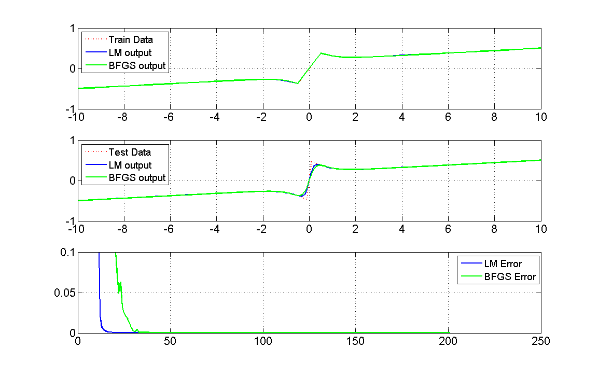
   
   
Second order transfer function (PT2)
------------------------------------

In this example a neural network is used to learn the response Y to an input P of a `second order transfer function`_ described by:

.. _`second order transfer function`: https://en.wikibooks.org/wiki/Signals_and_Systems/Second_Order_Transfer_Function

.. math::
	
	G(s) = \frac{Y(s)}{P(s)} = \frac{10}{0.1*s^2 + s + 100}

For training and testing the system a Amplitude Modlulated Pseudo Random Binary Sequence (APRBS) is used as input P and Ptest. A APRBS is a `Pseudorandom binary sequence`_ (PRBS), which is generated by a variation of the amplitude levels in addition to the variation of hold times of a PRBS.

 .. _`Pseudorandom binary sequence`: https://en.wikipedia.org/wiki/Pseudorandom_binary_sequence
 
This is an example of a **dynamic system with one input and one output** and can be found in ``python\examples\example_pt2.py`` and ``matlab\examples\example_pt2.m``.
 
Python
^^^^^^^^^^^

At first the needed packages are imported. pandas for reading the excelfile, matplotlib for plotting the results and pyrenn for the neural network.

::

	import pandas as pd
	import matplotlib.pyplot as plt
	import pyrenn as prn

Then the training input data P and output (target) data Y as well as the test input data Ptest and output data Ytest is read from the given excel file using pandas. Because we have only one input and one output here, the input and output data can be either a 1d numpy array, where the number of elements represents the number of data samples (this is the case here), or a 2d numpy array with shape (1,Q), where Q is the number of data samples. 
::

	df = pd.ExcelFile('example_data.xlsx').parse('pt2')
	P = df['P'].values
	Y = df['Y'].values
	Ptest = df['Ptest'].values
	Ytest = df['Ytest'].values

Then the neural network is created. Since we have a system with 1 input and 1 output, we need a neural network with the same number of inputs and outputs. For this system we choose a neural network with two hidden layers, each with 2 neurons. The system has no input delays, so we only use the current input dIn = [0]. Since we have a dynamic system, we want to create a recurrent neural network. We create a neural network with recurrent connections with delay of 1 timestep in the hidden layers (dIntern = [1]) and a recurrent connection with delay of 1 and 2 timesteps from the output to the first layer (dOut = [1,2])

 ::

	net = prn.CreateNN([1,2,2,1],dIn=[0],dIntern=[1],dOut=[1,2])

Now we can train the created neural network ``net`` with the training data P and Y. ``verbose=True`` activates diplaying the error during training. We set the number of iterations (epochs) to 100 and the termination error to 1e-3. The Training will stop after 100 iterations or when Error <= E_stop.

 ::

	net = prn.train_LM(P,Y,net,verbose=True,k_max=100,E_stop=1e-3) 
	
After the training is finished, we can use the neural network. We calculate the neural network output y, using the training data P as input as well as the the output ytest, using the test data Ptest as input.

 ::

	y = prn.NNOut(P,net)
	ytest = prn.NNOut(Ptest,net)

Now we can plot the results, comparing the output of the neural network with the training and the test data of the system.

 ::

	fig = plt.figure(figsize=(11,7))
	ax0 = fig.add_subplot(211)
	ax1 = fig.add_subplot(212)
	fs=18

	#Train Data
	ax0.set_title('Train Data',fontsize=fs)
	ax0.plot(y,color='b',lw=2,label='NN Output')
	ax0.plot(Y,color='r',marker='None',linestyle=':',lw=3,markersize=8,label='Train Data')
	ax0.tick_params(labelsize=fs-2)
	ax0.legend(fontsize=fs-2,loc='upper left')
	ax0.grid()

	#Test Data
	ax1.set_title('Test Data',fontsize=fs)
	ax1.plot(ytest,color='b',lw=2,label='NN Output')
	ax1.plot(Ytest,color='r',marker='None',linestyle=':',lw=3,markersize=8,label='Test Data')
	ax1.tick_params(labelsize=fs-2)
	ax1.legend(fontsize=fs-2,loc='upper left')
	ax1.grid()

	fig.tight_layout()
	plt.show()

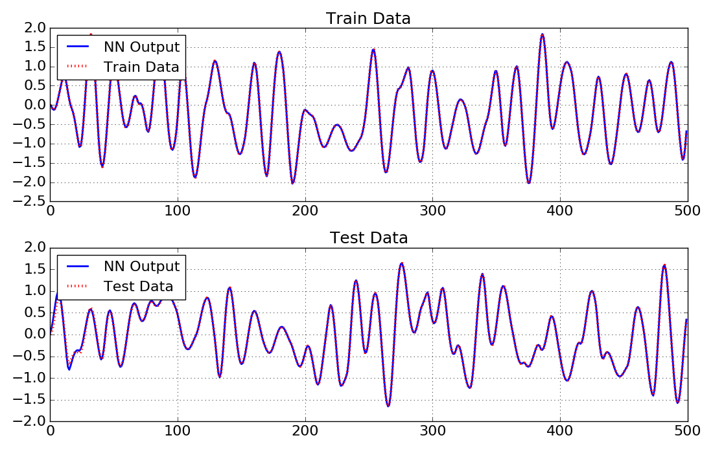
   
Matlab
^^^^^^^^^^^

At first the training input data P and output (target) data Y as well as the test input data Ptest and output data Ytest is read from the given excel file using ``xlsread``. Because we have only one input and one output here, the input and output data has to be an array with size ``(1,Q)``, where Q is the number of data samples. 

.. code-block:: matlab

	file = 'example_data.xlsx';
	num = xlsread(file,'pt2');
	P = num(:,2).';
	Y = num(:,3).';
	Ptest = num(:,4).';
	Ytest = num(:,5).';

Then the neural network is created. Since we have a system with 1 input and 1 output, we need a neural network with the same number of inputs and outputs. For this system we choose a neural network with two hidden layers, each with 2 neurons. The system has no input delays, so we only use the current input dIn = [0]. Since we have a dynamic system, we want to create a recurrent neural network. We create a neural network with recurrent connections with delay of 1 timestep in the hidden layers (dIntern = [1]) and a recurrent connection with delay of 1 and 2 timesteps from the output to the first layer (dOut = [1,2])

.. code-block:: matlab

	nn = [1 2 2 1];
	dIn = [0];
	dIntern=[1];
	dOut=[1,2];
	net = CreateNN(nn,dIn,dIntern,dOut);

Now we can train the created neural network ``net`` with the training data P and Y. In matlab we have the option to train the network with the LM algorithm or the BFGS algorithm.

We start with the LM algorithm. We set the number of iterations (epochs) to 100 and the termination error to 1e-3. The Training will stop after 100 iterations or when Error <= E_stop.

.. code-block:: matlab

	netLM = train_LM(P,Y,net,100,1e-3);
	
After the training is finished, we can use the neural network. We calculate the neural network output y_LM, using the training data P as input as well as the the output ytest_LM, using the test data Ptest as input.

.. code-block:: matlab

	y_LM = NNOut(P,netLM); 
	ytest_LM = NNOut(Ptest,netLM); 

Now we can do the same using the BFGS algorithm. The BFGS algorithm usually takes less time for one iteration, but needs more iterations to reach the same error than the LM. Therefore we set the number of iterations (epochs) to 200 and the termination error to 1e-3. 

.. code-block:: matlab

	netBFGS = train_BFGS(P,Y,net,200,1e-3);
	y_BFGS = NNOut(P,netBFGS); 
	ytest_BFGS = NNOut(Ptest,netBFGS);  
	
Now we can plot the results, comparing the output of the two different neural networks with each other and with the training and the test data of the system.

.. code-block:: matlab

	fig = figure();
	set(fig, 'Units', 'normalized', 'Position', [0.2, 0.1, 0.6, 0.6])
	axis tight

	subplot(311)
	set(gca,'FontSize',16)
	plot(Y,'r:','LineWidth',2)
	hold on
	grid on
	plot(y_LM,'b','LineWidth',2)
	plot(y_BFGS,'g','LineWidth',2)
	l1 = legend('Train Data','LM output','BFGS output','Location','northwest');
	set(l1,'FontSize',14)

	subplot(312)
	set(gca,'FontSize',16)
	plot(Ytest,'r:','LineWidth',2)
	hold on
	grid on
	plot(ytest_LM,'b','LineWidth',2)
	plot(ytest_BFGS,'g','LineWidth',2)
	l2 = legend('Test Data','LM output','BFGS output','Location','northwest');
	set(l2,'FontSize',14)

	subplot(313)
	set(gca,'FontSize',16)
	plot(netLM.ErrorHistory,'b','LineWidth',2)
	hold on
	grid on
	plot(netBFGS.ErrorHistory,'g','LineWidth',2)
	ylim([0,0.1])
	l3 = legend('LM Error','BFGS Error','Location','northeast');
	set(l3,'FontSize',14)

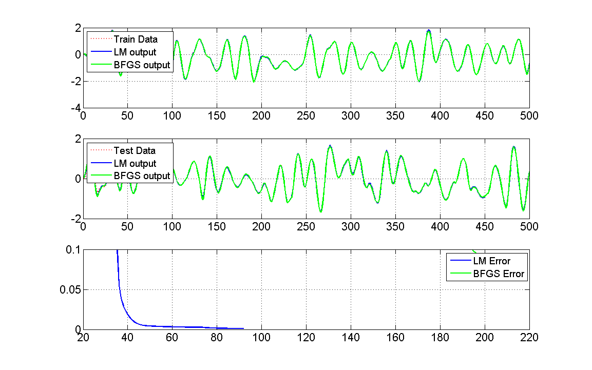

.. _narendra4:

narendra4
----------

In this example a neural network is used to learn the narendra4 function introduced in 

Narendra, K.S. und K. Parthasarathy: Identification and control of dynamical systems using neural networks. IEEE Transactions on Neural Networks, 1(1):4–27,March 1990.

given by:

.. math::
	
	y[k+1] = \frac{y[k]*y[k-1]*y[k-2]*p[k-1]*(y[k-2]-1)+p[k]}{1+(y[k-1])^2 + (y[k-2])^2}

For training and testing the system a Amplitude Modlulated Pseudo Random Binary Sequence (APRBS) is used as input P and Ptest. A APRBS is a `Pseudorandom binary sequence`_ (PRBS), which is generated by a variation of the amplitude levels in addition to the variation of hold times of a PRBS.

 .. _`Pseudorandom binary sequence`: https://en.wikipedia.org/wiki/Pseudorandom_binary_sequence
 
This is an example of a **dynamic system with one output and one delayed input** and can be found in ``python\examples\example_narendra4.py`` and ``matlab\examples\example_narendra4.m``.

Python
^^^^^^^^^^^

At first the needed packages are imported. pandas for reading the excelfile, matplotlib for plotting the results and pyrenn for the neural network.

::

	import pandas as pd
	import matplotlib.pyplot as plt
	import pyrenn as prn

Then the training input data P and output (target) data Y as well as the test input data Ptest and output data Ytest is read from the given excel file using pandas. Because we have only one input and one output here, the input and output data can be either a 1d numpy array, where the number of elements represents the number of data samples (this is the case here), or a 2d numpy array with shape (1,Q), where Q is the number of data samples. 
::

	df = pd.ExcelFile('example_data.xlsx').parse('narendra4')
	P = df['P'].values
	Y = df['Y'].values
	Ptest = df['Ptest'].values
	Ytest = df['Ytest'].values

Then the neural network is created. Since we have a system with 1 input and 1 output, we need a neural network with the same number of inputs and outputs. For this system we choose a neural network with two hidden layers, each with 3 neurons. To calculate the current output y[k], this system needs the inputs delayed by 1 and 2 time-steps p[k-1] and p[k-2], but not the current one p[k]. So we set the input delays to dIn = [1,2]. Since we have a dynamic system, we want to create a recurrent neural network. We know that the system has no internal states, so we do not need internal recurrent connections (dIntern = []). But we need a recurrent connection with delay of 1,2 and 3 timesteps from the output to the first layer (dOut = [1,2,3]), to calculate the current output y[k].

::

	net = prn.CreateNN([1,3,3,1],dIn=[1,2],dIntern=[],dOut=[1,2,3])

Now we can train the created neural network ``net`` with the training data P and Y. ``verbose=True`` activates diplaying the error during training. We set the number of iterations (epochs) to 200 and the termination error to 1e-3. The Training will stop after 200 iterations or when Error <= E_stop.

::

	net = prn.train_LM(P,Y,net,verbose=True,k_max=200,E_stop=1e-3) 
	
After the training is finished, we can use the neural network. We calculate the neural network output y, using the training data P as input as well as the the output ytest, using the test data Ptest as input.

::

	y = prn.NNOut(P,net)
	ytest = prn.NNOut(Ptest,net)

Now we can plot the results, comparing the output of the neural network with the training and the test data of the system.

::

	fig = plt.figure(figsize=(11,7))
	ax0 = fig.add_subplot(211)
	ax1 = fig.add_subplot(212)
	fs=18
	
	#Train Data
	ax0.set_title('Train Data',fontsize=fs)
	ax0.plot(y,color='b',lw=2,label='NN Output')
	ax0.plot(Y,color='r',marker='None',linestyle=':',lw=3,markersize=8,label='Train Data')
	ax0.tick_params(labelsize=fs-2)
	ax0.legend(fontsize=fs-2,loc='upper left')
	ax0.grid()
	
	#Test Data
	ax1.set_title('Test Data',fontsize=fs)
	ax1.plot(ytest,color='b',lw=2,label='NN Output')
	ax1.plot(Ytest,color='r',marker='None',linestyle=':',lw=3,markersize=8,label='Test Data')
	ax1.tick_params(labelsize=fs-2)
	ax1.legend(fontsize=fs-2,loc='upper left')
	ax1.grid()
	
	fig.tight_layout()
	plt.show()

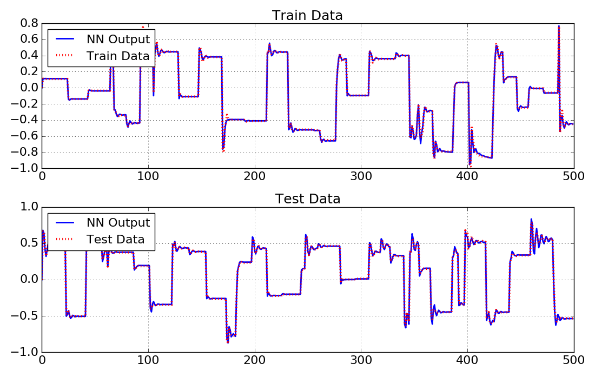

Matlab
^^^^^^^^^^^

At first the training input data P and output (target) data Y as well as the test input data Ptest and output data Ytest is read from the given excel file using ``xlsread``. Because we have only one input and one output here, the input and output data has to be an array with size ``(1,Q)``, where Q is the number of data samples. 

.. code-block:: matlab

	file = 'example_data.xlsx';
	num = xlsread(file,'narendra4');
	P = num(:,2).';
	Y = num(:,3).';
	Ptest = num(:,4).';
	Ytest = num(:,5).';

Then the neural network is created. Since we have a system with 1 input and 1 output, we need a neural network with the same number of inputs and outputs. For this system we choose a neural network with two hidden layers, each with 3 neurons. To calculate the current output y[k], this system needs the inputs delayed by 1 and 2 time-steps p[k-1] and p[k-2], but not the current one p[k]. So we set the input delays to dIn = [1,2]. Since we have a dynamic system, we want to create a recurrent neural network. We know that the system has no internal states, so we do not need internal recurrent connections (dIntern = []). But we need and a recurrent connection with delay of 1,2 and 3 timesteps from the output to the first layer (dOut = [1,2,3]), to calculate the current output y[k].

.. code-block:: matlab

	nn = [1 2 2 1];
	dIn = [1,2];
	dIntern=[];
	dOut=[1,2,3];
	net = CreateNN(nn,dIn,dIntern,dOut);

Now we can train the created neural network ``net`` with the training data P and Y. In matlab we have the option to train the network with the LM algorithm or the BFGS algorithm.

We start with the LM algorithm. We set the number of iterations (epochs) to 200 and the termination error to 1e-3. The Training will stop after 200 iterations or when Error <= E_stop.

.. code-block:: matlab

	netLM = train_LM(P,Y,net,200,1e-3);
	
After the training is finished, we can use the neural network. We calculate the neural network output y_LM, using the training data P as input as well as the the output ytest_LM, using the test data Ptest as input.

.. code-block:: matlab

	y_LM = NNOut(P,netLM); 
	ytest_LM = NNOut(Ptest,netLM); 

Now we can do the same using the BFGS algorithm. The BFGS algorithm usually takes less time for one iteration, but needs more iterations to reach the same error than the LM. Therefore we set the number of iterations (epochs) to 400 and the termination error to 1e-3. 

.. code-block:: matlab

	netBFGS = train_BFGS(P,Y,net,400,1e-3);
	y_BFGS = NNOut(P,netBFGS); 
	ytest_BFGS = NNOut(Ptest,netBFGS);  
	
Now we can plot the results, comparing the output of the two different neural networks with each other and with the training and the test data of the system.

.. code-block:: matlab

	fig = figure();
	set(fig, 'Units', 'normalized', 'Position', [0.2, 0.1, 0.6, 0.6])
	axis tight

	subplot(311)
	set(gca,'FontSize',16)
	plot(Y,'r:','LineWidth',2)
	hold on
	grid on
	plot(y_LM,'b','LineWidth',2)
	plot(y_BFGS,'g','LineWidth',2)
	l1 = legend('Train Data','LM output','BFGS output','Location','northwest');
	set(l1,'FontSize',14)

	subplot(312)
	set(gca,'FontSize',16)
	plot(Ytest,'r:','LineWidth',2)
	hold on
	grid on
	plot(ytest_LM,'b','LineWidth',2)
	plot(ytest_BFGS,'g','LineWidth',2)
	l2 = legend('Test Data','LM output','BFGS output','Location','northwest');
	set(l2,'FontSize',14)

	subplot(313)
	set(gca,'FontSize',16)
	plot(netLM.ErrorHistory,'b','LineWidth',2)
	hold on
	grid on
	plot(netBFGS.ErrorHistory,'g','LineWidth',2)
	ylim([0,5])
	l3 = legend('LM Error','BFGS Error','Location','northeast');
	set(l3,'FontSize',14)

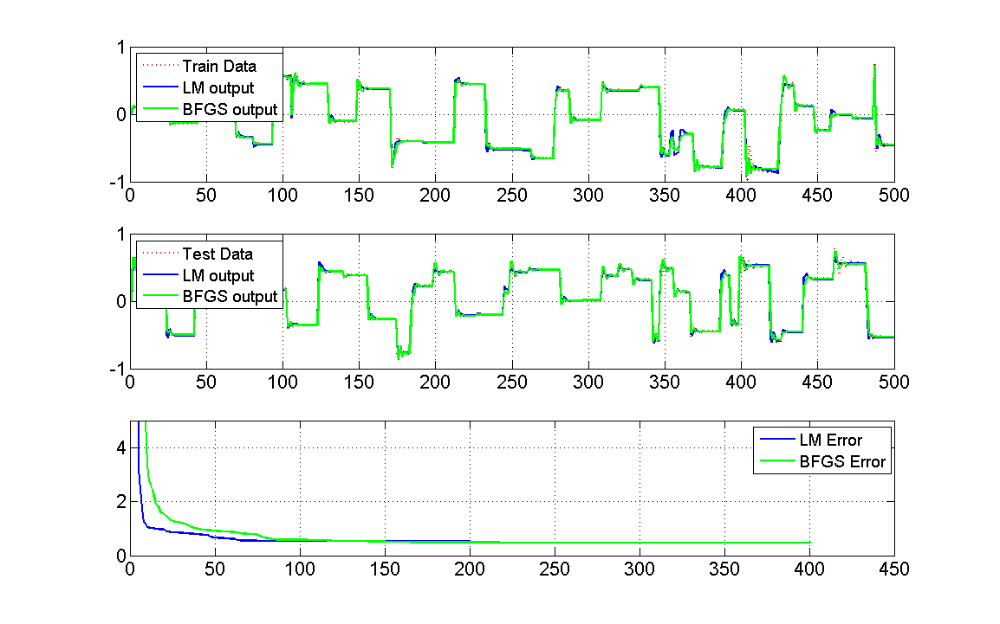
   
   
Compressed air storage system
------------------------------

In this example a neural network is used to learn the behavior of a compressed air storage test system.

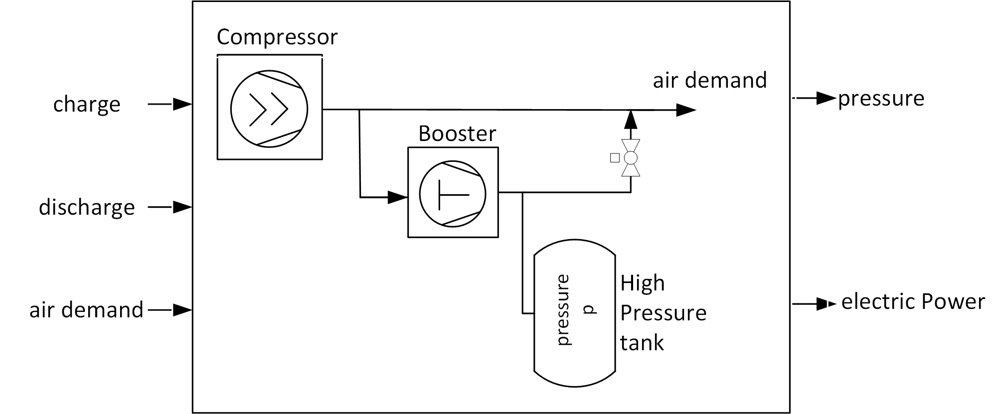

The system consists of a compressor, a booster, and a high pressure storage. The system has 3 inputs. If the binary input P1 (charge) is 1, the booster is running and charges the storage (to a maximum pressure of 38 bar). If the binary input P2 (discharge) is 1, the booster and the compressor are off and the air demand (input P3) is covered by the air in the storage, which is discharged (to a minimum pressure of 7 bar). If the storage is neither charged nor discharged, the compressor covers the air demand. The neural network is trained to calculate the state of the pressure in the storage (Y1) and the electric power consumption of the booster and the compressor (Y2) based on the given current inputs and the previous outputs.

This is an example of a **dynamic system with 2 outputs and 3 inputs** (see ``python\examples\example_compair.py`` and ``matlab\examples\example_compair.m``).

Python
^^^^^^^^^^^

At first the needed packages are imported. pandas for reading the excelfile, matplotlib for plotting the results and pyrenn for the neural network.

::

	import pandas as pd
	import matplotlib.pyplot as plt
	import pyrenn as prn

Then the training input data P and output (target) data Y as well as the test input data Ptest and output data Ytest is read from the given excel file using pandas. We have 3 inputs here, so the input P is a 2d array with shape(3,Q), where Q is the number of data samples. Since we have 2 ouputs the output Y is a 2d array with shape (2,Q).

::

	df = pd.ExcelFile('example_data.xlsx').parse('compressed_air')
	P = np.array([df['P1'].values,df['P2'].values,df['P3'].values])
	Y = np.array([df['Y1'].values,df['Y2']])
	Ptest = np.array([df['P1test'].values,df['P2test'].values,df['P3test'].values])
	Ytest = np.array([df['Y1test'].values,df['Y2test']])

Then the neural network is created. Since we have a system with 3 inputs and 2 outputs, we need a neural network with the same number of inputs and outputs. For this system we choose a neural network with two hidden layers, each with 5 neurons. The system has no input delays, so we only use the current input dIn = [0]. Since we have a dynamic system, we want to create a recurrent neural network. We know that the system has no internal states, so we do not need internal recurrent connections (dIntern = []). But we need and a recurrent connection with delay of 1 timesteps from the output to the first layer (dOut = [1]), because the pressure of the current time-step depends on the pressure in the previous one.

 ::

	net = prn.CreateNN([3,5,5,2],dIn=[0],dIntern=[],dOut=[1])

Now we can train the created neural network ``net`` with the training data P and Y. ``verbose=True`` activates diplaying the error during training. We set the number of iterations (epochs) to 500 and the termination error to 1e-5. The Training will stop after 500 iterations or when Error <= E_stop.

 ::

	net = prn.train_LM(P,Y,net,verbose=True,k_max=500,E_stop=1e-5) 
	
After the training is finished, we can use the neural network. We calculate the neural network output y, using the training data P as input as well as the the output ytest, using the test data Ptest as input. Since we have 2 outputs, y and ytest here are 2d arrays of shape (2,Q).

 ::

	y = prn.NNOut(P,net)
	ytest = prn.NNOut(Ptest,net)

Now we can plot the results, comparing the output of the neural network with the training and the test data of the system.

 ::

	fig = plt.figure(figsize=(15,10))
	ax0 = fig.add_subplot(221)
	ax1 = fig.add_subplot(222,sharey=ax0)
	ax2 = fig.add_subplot(223)
	ax3 = fig.add_subplot(224,sharey=ax2)
	fs=18

	t = np.arange(0,480.0)/4 #480 timesteps in 15 Minute resolution
	#Train Data
	ax0.set_title('Train Data',fontsize=fs)
	ax0.plot(t,y[0],color='b',lw=2,label='NN Output')
	ax0.plot(t,Y[0],color='r',marker='None',linestyle=':',lw=3,markersize=8,label='Data')
	ax0.tick_params(labelsize=fs-2)
	ax0.legend(fontsize=fs-2,loc='upper left')
	ax0.grid()
	ax0.set_ylabel('Storage Pressure [bar]',fontsize=fs)
	plt.setp(ax0.get_xticklabels(), visible=False)

	ax2.plot(t,y[1],color='b',lw=2,label='NN Output')
	ax2.plot(t,Y[1],color='r',marker='None',linestyle=':',lw=3,markersize=8,label='Train Data')
	ax2.tick_params(labelsize=fs-2)
	ax2.grid()
	ax2.set_xlabel('Time [h]',fontsize=fs)
	ax2.set_ylabel('el. Power [kW]',fontsize=fs)

	#Test Data
	ax1.set_title('Test Data',fontsize=fs)
	ax1.plot(t,ytest[0],color='b',lw=2,label='NN Output')
	ax1.plot(t,Ytest[0],color='r',marker='None',linestyle=':',lw=3,markersize=8,label='Test Data')
	ax1.tick_params(labelsize=fs-2)
	# ax1.legend(fontsize=fs-2,loc='upper left')
	ax1.grid()
	plt.setp(ax1.get_xticklabels(), visible=False)
	plt.setp(ax1.get_yticklabels(), visible=False)

	ax3.plot(t,ytest[1],color='b',lw=2,label='NN Output')
	ax3.plot(t,Ytest[1],color='r',marker='None',linestyle=':',lw=3,markersize=8,label='Test Data')
	ax3.tick_params(labelsize=fs-2)
	ax3.grid()
	ax3.set_xlabel('Time [h]',fontsize=fs)
	plt.setp(ax3.get_yticklabels(), visible=False)

	fig.tight_layout()
	plt.show()

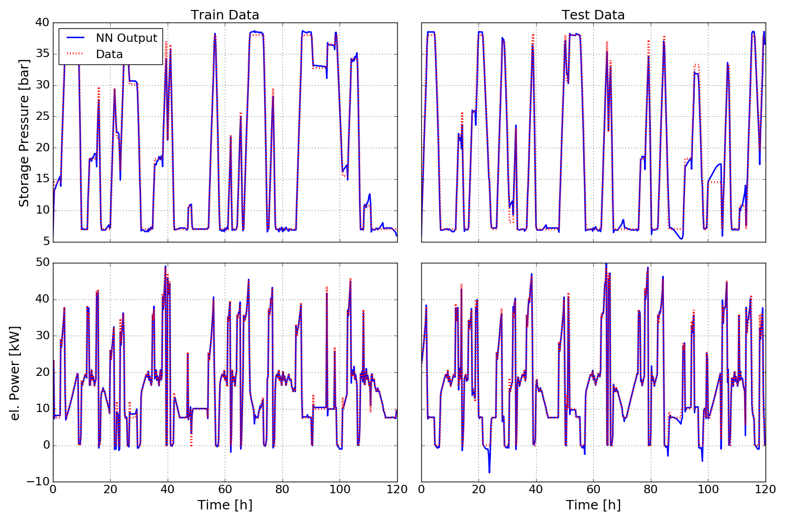

Matlab
^^^^^^^^^^^

At first the training input data P and output (target) data Y as well as the test input data Ptest and output data Ytest is read from the given excel file using ``xlsread``. We have 3 inputs here, so the input P is a 2d array with size(3,Q), where Q is the number of data samples. Since we have 2 ouputs the output Y is a 2d array with size (2,Q).

.. code-block:: matlab

	file = 'example_data.xlsx';
	num = xlsread(file,'compressed_air');
	P = num(:,2:4).';
	Y = num(:,5:6).';
	Ptest = num(:,7:9).';
	Ytest = num(:,10:11).';

Then the neural network is created. Since we have a system with 3 inputs and 2 outputs, we need a neural network with the same number of inputs and outputs. For this system we choose a neural network with two hidden layers, each with 5 neurons. The system has no input delays, so we only use the current input dIn = [0]. Since we have a dynamic system, we want to create a recurrent neural network. We know that the system has no internal states, so we do not need internal recurrent connections (dIntern = []). But we need and a recurrent connection with delay of 1 timesteps from the output to the first layer (dOut = [1]), because the pressure of the current time-step depends on the pressure in the previous one.

.. code-block:: matlab

	nn = [3 5 5 2];
	dIn = [0];
	dIntern=[];
	dOut=[1];
	net = CreateNN(nn,dIn,dIntern,dOut);

Now we can train the created neural network ``net`` with the training data P and Y. In matlab we have the option to train the network with the LM algorithm or the BFGS algorithm.

We start with the LM algorithm. We set the number of iterations (epochs) to 500 and the termination error to 1e-5. The Training will stop after 500 iterations or when Error <= E_stop.

.. code-block:: matlab

	netLM = train_LM(P,Y,net,500,1e-5);
	
After the training is finished, we can use the neural network. We calculate the neural network output y_LM, using the training data P as input as well as the the output ytest_LM, using the test data Ptest as input. Since we have 2 outputs, y and ytest here are 2d arrays of ssize (2,Q).

.. code-block:: matlab

	y_LM = NNOut(P,netLM); 
	ytest_LM = NNOut(Ptest,netLM); 

Now we can do the same using the BFGS algorithm. The BFGS algorithm usually takes less time for one iteration, but needs more iterations to reach the same error than the LM. Therefore we set the number of iterations (epochs) to 1000 and the termination error to 1e-5. 

.. code-block:: matlab

	netBFGS = train_BFGS(P,Y,net,1000,1e-5);
	y_BFGS = NNOut(P,netBFGS); 
	ytest_BFGS = NNOut(Ptest,netBFGS);  
	
Now we can plot the results, comparing the output of the two different neural networks with each other and with the training and the test data of the system.

.. code-block:: matlab

	t = (1:480.0)./4; %480 timesteps in 15 Minute resolution

	fig = figure();
	set(fig, 'Units', 'normalized', 'Position', [0.2, 0.1, 0.6, 0.6])

	subplot(221)
	title('Test Data')
	set(gca,'FontSize',16)
	plot(t,Y(1,:),'r:','LineWidth',2)
	hold on
	grid on
	plot(t,y_LM(1,:),'b','LineWidth',2)
	plot(t,y_BFGS(1,:),'g','LineWidth',2)
	l1 = legend('Train Data','LM output','BFGS output','Location','northoutside','Orientation','horizontal');
	set(l1,'FontSize',14)
	ylabel('Storage Pressure [bar]')
	axis tight

	subplot(223)
	set(gca,'FontSize',16)
	plot(t,Y(2,:),'r:','LineWidth',2)
	hold on
	grid on
	plot(t,y_LM(2,:),'b','LineWidth',2)
	plot(t,y_BFGS(2,:),'g','LineWidth',2)
	ylabel('el. Power [kW]')
	xlabel('time [h]')
	axis tight

	subplot(222)
	title('Train Data')
	set(gca,'FontSize',16)
	plot(t,Ytest(1,:),'r:','LineWidth',2)
	hold on
	grid on
	plot(t,ytest_LM(1,:),'b','LineWidth',2)
	plot(t,ytest_BFGS(1,:),'g','LineWidth',2)
	l2 = legend('Test Data','LM output','BFGS output','Location','northoutside','Orientation','horizontal');
	set(l2,'FontSize',14)
	axis tight

	subplot(224)
	set(gca,'FontSize',16)
	plot(t,Ytest(2,:),'r:','LineWidth',2)
	hold on
	grid on
	plot(t,ytest_LM(2,:),'b','LineWidth',2)
	plot(t,ytest_BFGS(2,:),'g','LineWidth',2)
	xlabel('time [h]')
	axis tight

.. figure:: img/example_matlab_compair.png
	:width: 95%
	:align: center
  
Using previous data P0 and Y0 in a recurrent neural network
------------------------------------------------------------

This example shows how to use known previous data P0 and Y0 when using a trained neural network to calculate outputs (see :ref:`use_prev`).

It is based on the :ref:`narendra4` example and can be found in ``python\examples\example_using_P0Y0_narendra4.py`` and ``matlab\examples\example_using_P0Y0_narendra4.m``.  Another example that shows how to use previous inputs and outputs P0 and Y0 can be found in ``example_using_P0Y0_compair.py`` and ``example_using_P0Y0_compair.m``

Python
^^^^^^^^^^^

At first the needed packages are imported, and the training and test data is read from the excel file.

::

	import pandas as pd
	import matplotlib.pyplot as plt
	import pyrenn as prn
	
	df = pd.ExcelFile('example_data.xlsx').parse('narendra4')
	P = df['P'].values
	Y = df['Y'].values
	Ptest_ = df['Ptest'].values
	Ytest_ = df['Ytest'].values

Now we assume, that we already know the first 3 data samples of the input and output of test data and define them as P0test and Y0test (we choose 3 time-steps, because the neural network has a maximum delay of 3). Then we define the applied test data Ptest and the system output we can compare the network output with Ytest, which do not contain the data samples we already know.

::
	
	#define the first 3 timesteps t=[0,1,2] of Test Data as previous (known) data P0test and Y0test
	P0test = Ptest_[0:3]
	Y0test = Ytest_[0:3]
	#Use the timesteps t = [3..99] as Test Data
	Ptest = Ptest_[3:100]
	Ytest = Ytest_[3:100]

Then we create and train the network

::

	net = prn.CreateNN([1,3,3,1],dIn=[1,2],dIntern=[],dOut=[1,2,3])
	net = prn.train_LM(P,Y,net,verbose=True,k_max=200,E_stop=1e-3)
	

Now we can use the trained network. To investigate the influence of using the previous data P0test and Y0test, we calculate the neural network output ytest0 with and ytest without using them.

::

	ytest = prn.NNOut(Ptest,net)
	y0test = prn.NNOut(Ptest,net,P0=P0test,Y0=Y0test)

Now we plot the results

::

	fig = plt.figure(figsize=(11,7))
	ax1 = fig.add_subplot(111)
	fs=18

	#Test Data
	ax1.set_title('Test Data',fontsize=fs)
	ax1.plot(ytest,color='b',lw=2,label='NN Output without P0,Y0')
	ax1.plot(y0test,color='g',lw=2,label='NN Output with P0,Y0')
	ax1.plot(Ytest,color='r',marker='None',linestyle=':',lw=3,markersize=8,label='Test Data')
	ax1.tick_params(labelsize=fs-2)
	ax1.legend(fontsize=fs-2,loc='lower right')
	ax1.grid()

	fig.tight_layout()
	plt.show()
	

Looking at the results, we can see the difference of the neural network outputs. If we do not use previous data P0 and Y0, the neural network sets the not known delayed inputs and outputs to zero, which leads to a poor result of the neural network ouput for the first time-steps. In contrast, when the prvoius outputs P0 and Y0 are used, the network shows good results from the beginning.
	
	
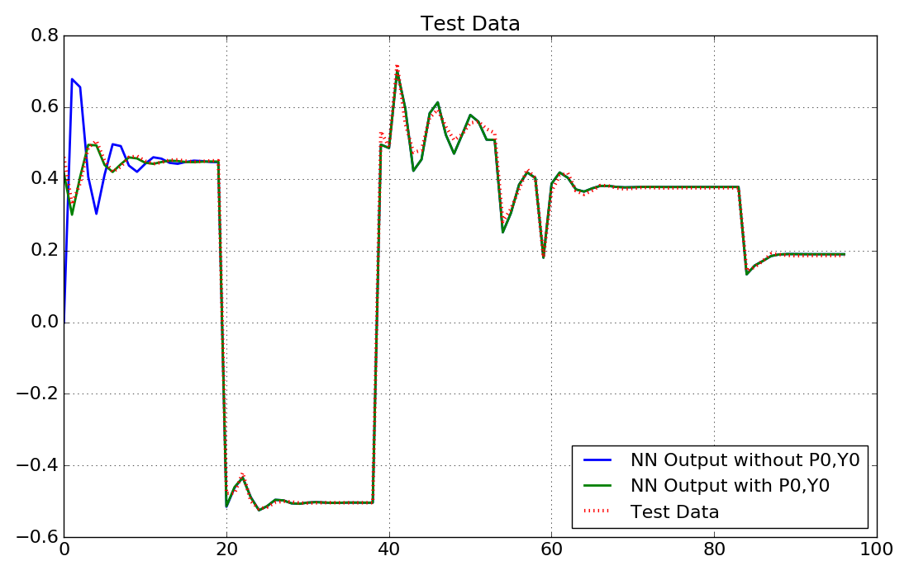
	

Matlab
^^^^^^^^^^^

At first the training and test data is read from the excel file.

.. code-block:: matlab

	file = 'example_data.xlsx';
	num = xlsread(file,'narendra4');
	P = num(:,2).';
	Y = num(:,3).';
	Ptest_ = num(:,4).';
	Ytest_ = num(:,5).';

	
Now we assume, that we already know the first 3 data samples of the input and output of test data and define them as P0test and Y0test (we choose 3 time-steps, because the neural network has a maximum delay of 3). Then we define the applied test data Ptest and the system output we can compare the network output with Ytest, which do not contain the data samples we already know.

.. code-block:: matlab

	%define the first 3 timestep t=[1,2,3] of Test Data as previous (known)
	%data P0test and Y0test
	P0test = Ptest_(:,1:3);
	Y0test = Ytest_(:,1:3);
	%Use the timesteps t = [4..100] as Test Data
	Ptest = Ptest_(:,4:100);
	Ytest = Ytest_(:,4:100);

Then we create and train the network with the LM algorithm

.. code-block:: matlab

	nn = [1 2 2 1];
	dIn = [1,2];
	dIntern=[];
	dOut=[1,2,3];
	net = CreateNN(nn,dIn,dIntern,dOut); 
	net = train_LM(P,Y,net,200,1e-3);

Now we can use the trained network. To investigate the influence of using the previous data P0test and Y0test, we calculate the neural network output ytest0 with and ytest without using them.

.. code-block:: matlab

	ytest = NNOut(Ptest,net); 
	y0test = NNOut(Ptest,net,P0test,Y0test);
	
Now we plot the results

.. code-block:: matlab

	fig = plt.figure(figsize=(11,7))
	ax1 = fig.add_subplot(111)
	fs=18

	#Test Data
	ax1.set_title('Test Data',fontsize=fs)
	ax1.plot(ytest,color='b',lw=2,label='NN Output without P0,Y0')
	ax1.plot(y0test,color='g',lw=2,label='NN Output with P0,Y0')
	ax1.plot(Ytest,color='r',marker='None',linestyle=':',lw=3,markersize=8,label='Test Data')
	ax1.tick_params(labelsize=fs-2)
	ax1.legend(fontsize=fs-2,loc='lower right')
	ax1.grid()

	fig.tight_layout()
	plt.show()
	
Looking at the results, we can see the difference of the neural network outputs. If we do not use previous data P0 and Y0, the neural network sets the not known delayed inputs and outputs to zero, which leads to a poor result of the neural network ouput for the first time-steps. In contrast, when the prvoius outputs P0 and Y0 are used, the network shows good results from the beginning.
	

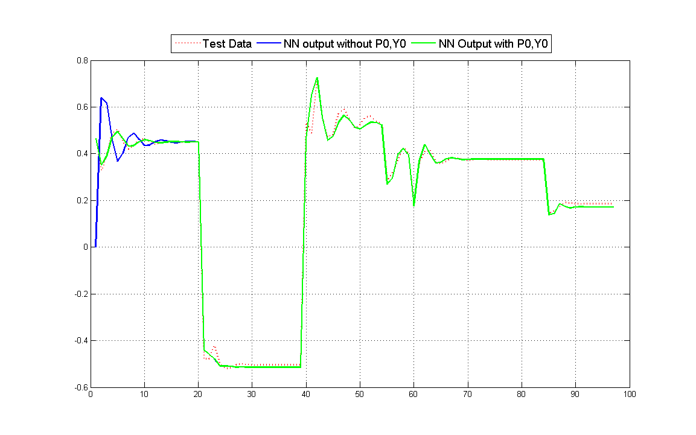

Calculate the gradient of a neural network
-------------------------------------------

This example shows how to calculate the gradient vector (or derivative vector) :math:`\underline{g}` of the Error :math:`E` of a neural network with respect to the weight vector :math:`\underline{w}`. The gradient vector can be calculated either using RTRL or BPTT algorithm. The gradient :math:`\underline{g}` or the Jacobian :math:`\widetilde{J}` can be used to implement other training algorithms than the ones given in pyrenn. The examples can be found in ``python\examples\gradient_calculation.py`` and ``matlab\examples\gradient_calculation.m``.

Calculating the gradient vector :math:`\underline{g}` with the RTRL algorithm needs more time than with the BPTT algorithm. But for calculating the Jacobian matrix :math:`\widetilde{J}`, the RTRL algorithm is faster than the BPTT algorithm (calculating :math:`\widetilde{J}` with BPTT is not implemented in pyrenn). So if the training algorithm uses the Jacaobian matrix :math:`\widetilde{J}` (like the LM algorithm), RTRL is prefered and if the  training algorithm uses the gradient vector :math:`\underline{g}` (like the BFGS algorithm), BPTT is preferred.

Python
^^^^^^^^^^^

At first the needed packages are imported, the training data is read from the excel file and a neural network is created.

::

	import numpy as np
	import pandas as pd
	import time

	import pyrenn as prn
	
	df = pd.ExcelFile('example_data.xlsx').parse('pt2')
	P = df['P'].values
	Y = df['Y'].values
	net = prn.CreateNN([1,2,2,1],dIn=[0],dIntern=[1],dOut=[1,2])

Then the dict ``data``, which contains the training data P and Y has to be created using ``prn.prepare_data()``.

::

	data,net = prn.prepare_data(P,Y,net)
	
Now the gradient can be calculated. The function ``prn.RTRL()`` uses the Real Time Recurrent Learning algorithm and returns the Jacobian matrix :math:`\widetilde{J}`, the error vector :math:`\underline{e}` and the error :math:`E` for the current weight vector :math:`\underline{w}=` ``net['w']``. The gradient vector :math:`\underline{g}` can then be caluclated with :math:`\underline{g} = 2 * \widetilde{J}^T * \underline{e}`

::

	J,E,e = prn.RTRL(net,data)
	g_rtrl = 2 * np.dot(J.transpose(),e)

The function ``prn.BPTT()`` uses the Back Propagation Through Time algorithm and returns the gradient vector :math:`\underline{g}` and the error :math:`E` for the current weight vector :math:`\underline{w}=` ``net['w']``

::

	g_bptt,E = prn.BPTT(net,data)
	
Matlab
^^^^^^^^^^^

At first the training data is read from the excel file and a neural network is created.

.. code-block:: matlab

	file = 'example_data.xlsx';
	num = xlsread(file,'pt2');
	P = num(:,2).';
	Y = num(:,3).';

	nn = [1 2 2 1];
	dIn = [0];
	dIntern=[1];
	dOut=[1,2];
	net = CreateNN(nn,dIn,dIntern,dOut); 

Then the struct ``data``, which contains the training data P and Y has to be created using ``prepare_data()``.

.. code-block:: matlab

	data = prepare_data(P,Y,net,{},0);
	
Now the gradient can be calculated. The function ``prn.RTRL()`` uses the Real Time Recurrent Learning algorithm and returns the Jacobian matrix :math:`\widetilde{J}`, the error vector :math:`\underline{e}` and the error :math:`E` for the current weight vector :math:`\underline{w}=` ``net.w``. The gradient vector :math:`\underline{g}` can then be caluclated with :math:`\underline{g} = 2 * \widetilde{J}^T * \underline{e}`

.. code-block:: matlab

	[J,E,e] = RTRL(net,data);
	g_rtrl = 2.*J'*e;

The function ``prn.BPTT()`` uses the Back Propagation Through Time algorithm and returns the gradient vector :math:`\underline{g}` and the error :math:`E` for the current weight vector :math:`\underline{w}=` ``net.w``.

.. code-block:: matlab

	g_bptt = BPTT(net,data);
    
    
Classification (MNIST Data)
------------------------

In this example a neural network is used to learn to recognize handwritten digits. 
Thefore the MNIST dataset hosted on `Yann LeCun's website`_ is used.
The data set consists of 60,000 data points for training and 10,000 data points for testing. To reduce the size of the data file, here only 25,000 data points for training and 5,000 for testing are used. 
Each data point is defined by an 28X28 pixel image (784 numbers) and the 
corresponing number represesented by a 10 element vector 
(one element for each digit 0,1,2,3,4,5,6,7,8,9). For the number n, 
only the n-th element is 1, all others are zero. So the vector [0 0 0 0 0 1 0 0 0 0] represents the number 5. 
A more detailed explanation of the MNIST data can be found in the `Tensorflow tutorial`_.

.. _ Yann LeCun's website: http://yann.lecun.com/exdb/mnist/page
.. _Tensorflow tutorial: https://www.tensorflow.org/get_started/mnist/beginners

Python
^^^^^^^^^^^

At first the needed packages are imported. pickle for reading the data, matplotlib for plotting the results, numpy for its random function and pyrenn for the neural network.

::

    import matplotlib as mpl
    import matplotlib.pyplot as plt
    import pickle
    import numpy as np
    import pyrenn as prn

Then the training input data P and output (target) data Y as well as the test input data Ptest and output data Ytest is read from the given pickle file. Each image is defined by the value of its 784 pixel, so P is a 2d array of size (784,Q), where Q is the number of data samples (25,000). Y is defined by an 10 element vector, which gives us a 2d array of size (10,Q=5000).

::

    mnist = pickle.load( open( "MNIST_data.pkl", "rb" ) )
    P = mnist['P']
    Y = mnist['Y']
    Ptest = mnist['Ptest']
    Ytest = mnist['Ytest']

Then the neural network is created. Since we have a system with 28*28 inputs and 10 outputs, we need a neural network with the same number of inputs and outputs. For this system we choose a neural network with one hidden layer with 10 neurons. Since there is no interconnection between the images, we do not need a recurrent network and no delayed inputs, so we do not have to change the delay inputs.

 ::

	net = prn.CreateNN([28*28,10,10])

Because training the network with all the available training data would need a lot of memory and time, we randomly extract a batch of 1000 data samples and use it to train the network. Because we want to use as much information of our data as possible, we only perform one iteration (k_max=1) and then extract a new batch. In this example we do this 20 times, so we train the net for 20 iterations, but each iteration with new training data.
``verbose=True`` activates diplaying the error during training.

 ::

    batch_size = 1000
    number_of_batches=20

    for i in range(number_of_batches):
        r = np.random.randint(0,25000-batch_size)
        Ptrain = P[:,r:r+batch_size]
        Ytrain = Y[:,r:r+batch_size]

        #Train NN with training data Ptrain=input and Ytrain=target
        #Set maximum number of iterations k_max
        #Set termination condition for Error E_stop
        #The Training will stop after k_max iterations or when the Error <=E_stop
        net = prn.train_LM(Ptrain,Ytrain,net,
                               verbose=True,k_max=1,E_stop=1e-5) 
        print('Batch No. ',i,' of ',number_of_batches) 
	
After the training is finished, we can use the neural network. Therefore we choose 9 random samples of the test data set and use the input to calculate the NN outputs
Then we can plot the results, comparing the output of the neural network (number above the image) with the training (image).

 ::

    idx = np.random.randint(0,5000-9) 
    P_ = Ptest[:,idx:idx+9]
    Y_ = prn.NNOut(P_,net)

    fig = plt.figure(figsize=[11,7])
    gs = mpl.gridspec.GridSpec(3,3)

    for i in range(9):
        
        ax = fig.add_subplot(gs[i])
        
        y_ = np.argmax(Y_[:,i]) #find index with highest value in NN output
        p_ = P_[:,i].reshape(28,28) #Convert input data for plotting
        
        ax.imshow(p_) #plot input data
        ax.set_xticks([])
        ax.set_yticks([])
        ax.set_title(str(y_), fontsize=18)
    
    plt.show()

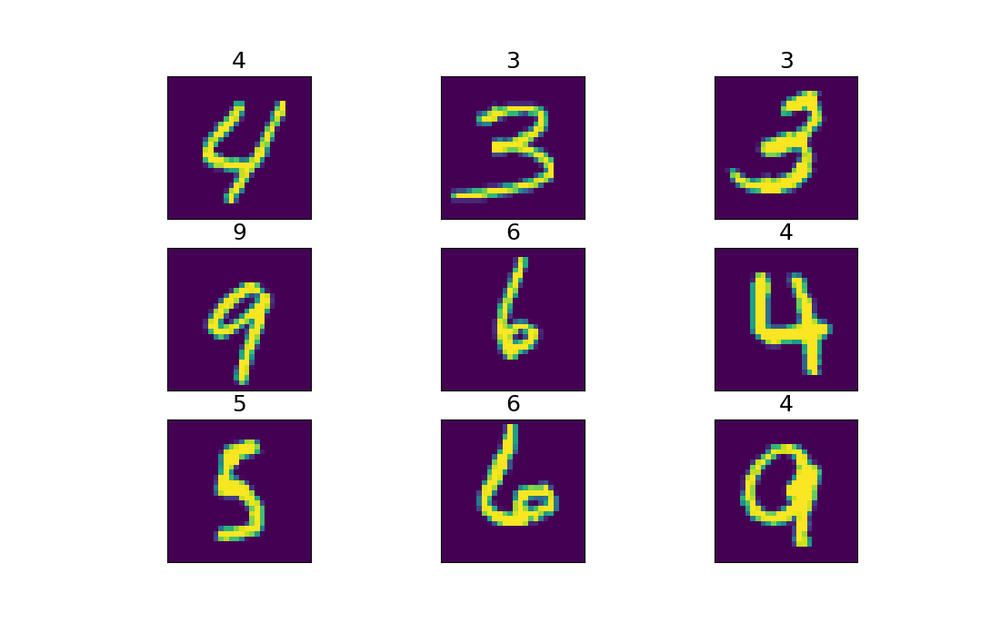

