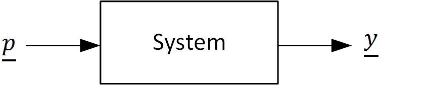
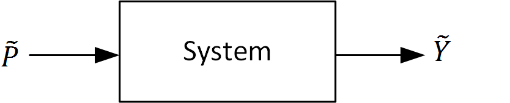
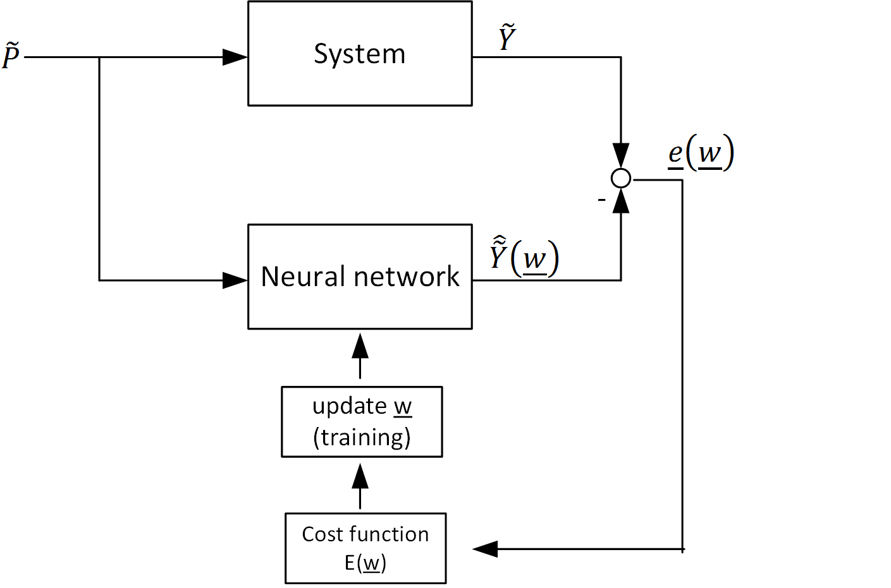

.. currentmodule:: pyrenn

.. _train:

Train a neural network
======================

Once a neural network is created, it can be trained. To train a neural network, training data is required. If you have a system, that produces the output :math:`\underline{y}`, when given the input :math:`\underline{p}` (see figure 6), :math:`(\underline{p},\underline{y})` represents one sample of training data.  

   
   Figure 6: A system with input :math:`\underline{p}` and output :math:`\underline{y}`

For training neural networks usually more than one data sample is required to obtain good results. Therefore the training data is defined by an input matrix :math:`\widetilde{P}` and an output (or target) matrix :math:`\widetilde{Y}` containing :math:`Q` samples of training data. For static systems (feed forward neural networks) it is only important that element :math:`q` of the input matrix corresponds to element :math:`q` of the output matrix (in any given order). For dynamic systems (recurrent neural networks) the samples have to be in the correct time order. For both systems, the training data should represent the system as good as possible.

   
   Figure 7: Generated training data set :math:`\widetilde{P}` and :math:`\widetilde{Y}` of a system

.. math::
	
	\widetilde{P} =  \begin{bmatrix}
	\underline{p}[1] & \underline{p}[2] & ... &\underline{p}[q] & ... &\underline{p}[Q]
	\end{bmatrix}\\
	\widetilde{Y} =  \begin{bmatrix}
	\underline{y}[1] & \underline{y}[2] & ... &\underline{y}[q] & ... &\underline{y}[Q]
	\end{bmatrix}\\

With the training data, the neural network can be trained. Training a neural network means, that all weights in the weight vector :math:`\underline{w}`, which contains all connection weights :math:`\widetilde{IW}` and :math:`\widetilde{LW}` and all bias weights :math:`\underline{b}`, are updated step by step, such that the neural network output :math:`\hat{\widetilde{Y}}` matches the training data output (target) :math:`\widetilde{Y}`. The objective of this optimization is to minimize the error :math:`E` (cost function) between neural network and system outputs.

   
   Figure 8: Training a neural network

.. note::
	
	Generally there are different methods to calculate the error :math:`E` (cost function) for neural network training. In pyrenn always the mean squared error is used, which is necessary to apply the Levenberg-Marquardt algorithm.  

The training repeats adapting the weights of the weight vector :math:`\underline{w}` until one of the two termination conditions becomes active:

* the maximal number of iterations (epochs) :math:`k_{max}` is reached
* the Error is minimized to the goal :math:`E \leq E_{stop}`

``train_LM()``: train with Levenberg-Marquardt Algorithm
--------------------------------------------------------

The function ``train_LM()`` is an implementation of the `Levenberg–Marquardt algorithm`_ (LM) based on: 

Levenberg, K.: A Method for the Solution of Certain Problems in Least Squares. Quarterly of Applied Mathematics, 2:164-168, 1944.

and

Marquardt, D.: An Algorithm for Least-Squares Estimation of Nonlinear Parameters. SIAM Journal, 11:431-441, 1963.

The LM algorithm is a second order optimization method that uses the Jacobian matrix :math:`\widetilde{J}` to approximate the Hessian matrix :math:`\widetilde{H}`. In pyrenn the Jacobian matrix is calculated using the `Real-Time Recurrent Learning (RTRL) algorithm`_ based on:

Williams, Ronald J.; Zipser, David: A Learning Algorithm for Continually Running Fully Recurrent Neural Networks. In: Neural Computation, Nummer 2, Vol. 1 (1989), S. 270-280

Python
^^^^^^^^^^^

.. py:function:: pyrenn.train_LM(P, Y, net ,[k_max=100, E_stop=1e-10, dampfac=3.0, dampconst=10.0, verbose = False])

	Trains the given neural network ``net`` with the training data inputs ``P`` and outputs (targets) ``Y`` using the Levenberg–Marquardt algorithm.

	:param numpy.array P: Training input data set :math:`\widetilde{P}`, 2d-array of shape :math:`(R,Q)` with :math:`R` rows (=number of inputs) and :math:`Q` columns (=number of training samples) 
	:param numpy.array Y: Training output (target) data set :math:`\widetilde{Y}`, 2d-array of shape :math:`(S^M,Q)` with :math:`S^M` rows (=number of outputs) and :math:`Q` columns (=number of training samples) 
	:param dict net: a pyrenn neural network object created by ``pyrenn.CreateNN()``
	:param int k_max: maximum number of training iterations (epochs)
	:param float E_stop: termination error (error goal), training stops when the :math:`E \leq E_{stop}`  
	:param float dampfac: damping factor of the LM algorithm
	:param float dampconst: constant to adapt damping factor of LM
	:param bool verbose: activates console outputs during training if True
	
	:return: a trained pyrenn neural network object
	:rtype: dict

Matlab
^^^^^^^^^^^

.. c:function:: train_LM(P, Y, net ,[k_max=100, E_stop=1e-10])

	Trains the given neural network ``net`` with the training data inputs ``P`` and outputs (targets) ``Y`` using the Levenberg–Marquardt algorithm.

	:param array P: Training input data set :math:`\widetilde{P}`, 2d-array with size :math:`(R,Q)` with :math:`R` rows (=number of inputs) and :math:`Q` columns (=number of training samples) 
	:param array Y: Training output (target) data set :math:`\widetilde{Y}`, 2d-array with size :math:`(S^M,Q)` with :math:`S^M` rows (=number of outputs) and :math:`Q` columns (=number of training samples) 
	:param struct net: a pyrenn neural network object created by ``CreateNN()``
	:param int k_max: maximum number of training iterations (epochs)
	:param double E_stop: termination error (error goal), training stops when the :math:`E \leq E_{stop}`  
	
	:return: a trained pyrenn neural network object
	:rtype: struct

	
``train_BFGS()``: train with Broyden–Fletcher–Goldfarb–Shanno Algorithm (Matlab only)
-------------------------------------------------------------------------------------

The function ``train_BFGS()`` is an implementation of the `Broyden–Fletcher–Goldfarb–Shanno algorithm`_ (BFGS). The BFGS algorithm is a second order optimization method that uses rank-one updates specified by evaluations of the gradient  :math:`\underline{g}` to approximate the Hessian matrix :math:`H`. In pyrenn the gradient :math:`\underline{g}` for BFGS is calculated using the `Backpropagation Through Time (BPTT) algorithm`_ based on:

Werbos, Paul: Backpropagation through time: what it does and how to do it. In: Proceedings of the IEEE, Nummer 10, Vol. 78 (1990), S. 1550-1560.

Matlab
^^^^^^^^^^^

.. c:function:: train_BFGS(P, Y, net ,[k_max=100, E_stop=1e-10])

	Trains the given neural network ``net`` with the training data inputs ``P`` and outputs (targets) ``Y`` using the Broyden–Fletcher–Goldfarb–Shanno algorithm. 

	:param array P: Training input data set :math:`\widetilde{P}`, 2d-array with size :math:`(R,Q)` with :math:`R` rows (=number of inputs) and :math:`Q` columns (=number of training samples) 
	:param array Y: Training output (target) data set :math:`\widetilde{Y}`, 2d-array with size :math:`(S^M,Q)` with :math:`S^M` rows (=number of outputs) and :math:`Q` columns (=number of training samples) 
	:param struct net: a pyrenn neural network object created by ``CreateNN()``
	:param int k_max: maximum number of training iterations (epochs)
	:param double E_stop: termination error (error goal), training stops when the :math:`E \leq E_{stop}`  
	
	:return: a trained pyrenn neural network object
	:rtype: struct	
	
	
.. _Levenberg–Marquardt algorithm: https://en.wikipedia.org/wiki/Levenberg%E2%80%93Marquardt_algorithm
.. _gradient descent: https://en.wikipedia.org/wiki/Gradient_descent
.. _Broyden–Fletcher–Goldfarb–Shanno algorithm: https://en.wikipedia.org/wiki/Broyden%E2%80%93Fletcher%E2%80%93Goldfarb%E2%80%93Shanno_algorithm
.. _Real-Time Recurrent Learning (RTRL) algorithm: http://www.mitpressjournals.org/doi/abs/10.1162/neco.1989.1.2.270#.VpDullJ1F3Q
.. _Backpropagation Through Time (BPTT) algorithm: https://en.wikipedia.org/wiki/Backpropagation_through_time

