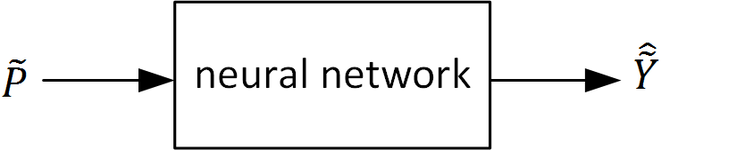

.. currentmodule:: pyrenn

.. _use:

Use a trained neural network
==============================

Once a neural network is trained successfully, it can be used to calculate the neural network outputs for new (different from the training data) input data. The input data  :math:`\widetilde{P}` for using the neural network has the same structure than for training. The neural network calculates the output data :math:`\hat{\widetilde{Y}}` which has the same structure than the training output data :math:`\widetilde{Y}`. Any arbitrary number of data samples :math:`Q` can be used, resulting in the same amount oft output samples.

   

.. math::
	
	\widetilde{P} =  \begin{bmatrix}
	\underline{p}[1] & \underline{p}[2] & ... &\underline{p}[q] & ... &\underline{p}[Q]
	\end{bmatrix}\\
	\hat{\widetilde{Y}} =  \begin{bmatrix}
	\underline{\hat{y}}[1] & \underline{\hat{y}}[2] & ... &\underline{\hat{y}}[q] & ... &\underline{\hat{y}}[Q]
	\end{bmatrix}\\

.. _use_prev:
	
Using previous inputs and outputs for recurrent networks or networks with delayed inputs
-----------------------------------------------------------------------------------------

Neural networks with delayed recurrent connections between their output and the input layer (green) and networks with delayed inputs :math:`d>0` (blue) need outputs or inputs of previous timesteps :math:`t-d` to calculate the output for timestep :math:`t`. When the neural netwoork is used applying the input data :math:`\widetilde{P}`, for the first time-step(s) these previous inputs and outputs are not known yet. pyrenn sets all unknown previous inputs and outputs to zero, which will probably lead to an error in the first time-steps.

.. figure:: img/recurrent_nn.*
	:width: 95%
	:align: center 
	
But pyrenn allows to pass previous inputs :math:`\widetilde{P0}` and previous outputs :math:`\widetilde{Y0}` to the neural network, if they are known by the user.  :math:`\widetilde{P0}` and :math:`\widetilde{Y0}` have the same structure than :math:`\widetilde{P}` and :math:`\widetilde{Y}`. Both must have the same number of previous data samples :math:`Q0`, even if one of them is irrelevant for the neural network. The neural network output :math:`\underline{\hat{y}}[q]` at time :math:`q` is then calculated using this previous inputs and outputs at time :math:`q-d`, where :math:`\underline{{p}}[0]` and :math:`\underline{\hat{y}}[0]` is the last element of :math:`\widetilde{P0}` and :math:`\widetilde{Y0}`, respectively.

.. math::
	\begin{gather}
	&\widetilde{P0} &\widetilde{P}\\
	&\overbrace{\begin{bmatrix}
	\underline{p}[Q0-1] & ... & \underline{p}[-1] & \underline{p}[0]
	\end{bmatrix}} \;
	&\overbrace{\begin{bmatrix}
	\underline{p}[1] & \underline{p}[2] & ... &\underline{p}[q] & ... &\underline{p}[Q]
	\end{bmatrix}}\\\\
	&\underbrace{\begin{bmatrix}
	\underline{\hat{y}}[Q0-1] & ... &\underline{\hat{y}}[-1] &\underline{\hat{y}}[0]
	\end{bmatrix}} \;
	&\underbrace{
	\underline{\hat{y}}[q] = f(\underline{p}[q],\underline{p}[q-d],\underline{\hat{y}}[q-d]) }\\
	&\widetilde{Y0} &\widetilde{Y} \\
	\end{gather}

Setting previous values for the outputs of hidden layers (red connections) is not possible. If a neural network has internal recurrent connections, the previous outputs of hidden layers are set to zero, when not known yet.

	
Calculate neural network outputs with ``NNOut()``
-------------------------------------------------

Python
^^^^^^^^^^^

.. py:function:: pyrenn.NNOut(P, net ,[P0=None, Y0=None])

	Calculates the output of a trained neural network ``net`` given the inputs ``P``

	:param numpy.array P: Input data set :math:`\widetilde{P}`, 2d-array of shape :math:`(R,Q)` with :math:`R` rows (=number of inputs) and :math:`Q` columns (=number of data samples) 
	:param dict net: a pyrenn neural network object
	:param numpy.array P0: Previous input data set :math:`\widetilde{P0}`, 2d-array of shape :math:`(R,Q0)` with :math:`R` rows (=number of inputs) and :math:`Q0` columns (=number of previous data samples) 
	:param numpy.array Y0: previous output data set :math:`\widetilde{Y0}`, 2d-array of shape :math:`(S^M,Q0)` with :math:`S^M` rows (=number of outputs) and :math:`Q0` columns (=number of previous data samples) 	
	:return: Neural network output :math:`\hat{\widetilde{Y}}`, 2d-array of shape :math:`(S^M,Q)` with :math:`S^M` rows (=number of outputs) and :math:`Q` columns (=number of input data samples) 
	:rtype: numpy.array

Matlab
^^^^^^^^^^^

.. c:function:: NNOut(P, net ,[P0=[ ], Y0=[ ]])

	Calculates the output of a trained neural network *net* given the inputs *P*

	:param array P: Input data set :math:`\widetilde{P}`, 2d-array of size :math:`(R,Q)` with :math:`R` rows (=number of inputs) and :math:`Q` columns (=number of data samples) 
	:param struct net: a pyrenn neural network object
	:param array P0: Previous input data set :math:`\widetilde{P0}`, 2d-array of size :math:`(R,Q0)` with :math:`R` rows (=number of inputs) and :math:`Q0` columns (=number of previous data samples) 
	:param array Y0: previous output data set :math:`\widetilde{Y0}`, 2d-array of size :math:`(S^M,Q0)` with :math:`S^M` rows (=number of outputs) and :math:`Q0` columns (=number of previous data samples) 	
	:return: Neural network output :math:`\hat{\widetilde{Y}}`, 2d-array of size :math:`(S^M,Q)` with :math:`S^M` rows (=number of outputs) and :math:`Q` columns (=number of input data samples) 
	:rtype: array
